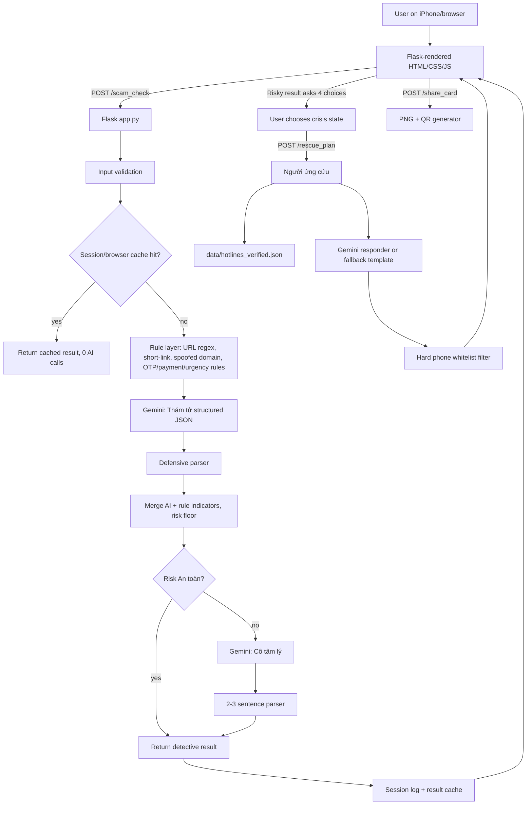
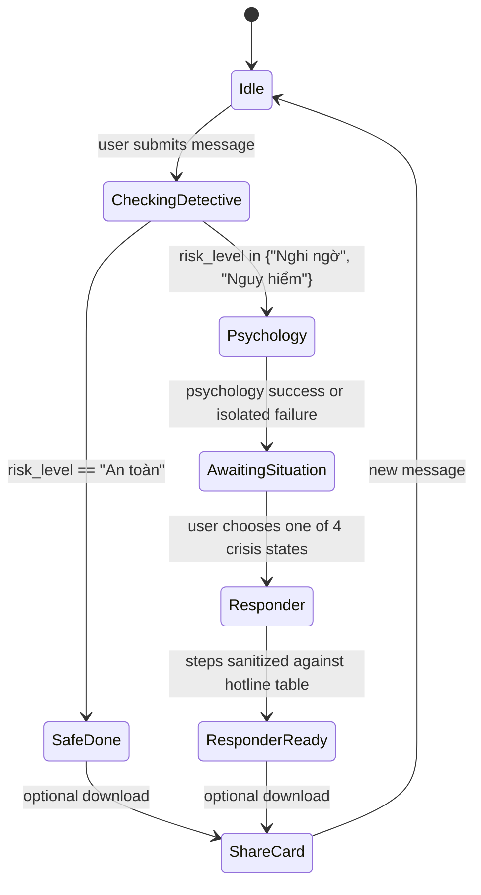

# Architecture And State Diagrams

## Data Flow



## Three-Role State Machine



## AI Call Reduction

Naive approach: always call all three roles.

```text
Detective + Cô tâm lý + Người ứng cứu = 3 AI calls
```

Current state machine:

- Safe message: Detective only = 1 call.
- Risky message before user picks crisis state: Detective + Cô tâm lý = 2 calls.
- Người ứng cứu is called only after the user chooses one of four situations.
- Duplicate message from cache = 0 new AI calls.

The code path is implemented in:

- `run_ai_sequence`
- `run_responder`
- `state_machine_metrics`
- frontend `renderSituation` and `requestRescuePlan`
